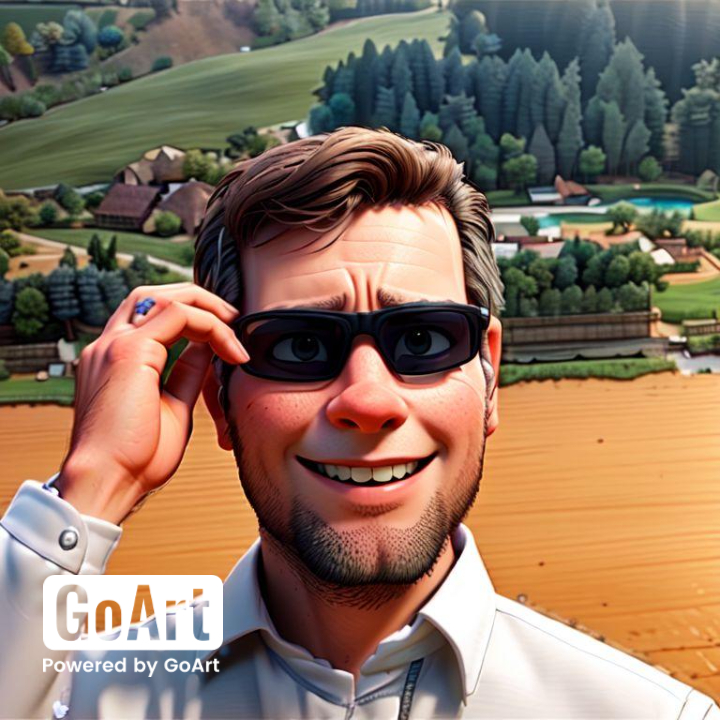
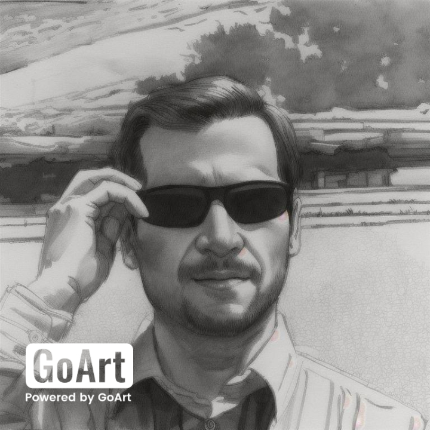

# Style Transfer

Style transfer is a fascinating technique that combines the artistic style of one image with the content of another. It allows you to create visually captivating and unique compositions. Whether you're an artist, photographer, or simply curious about digital art, style transfer offers endless creative possibilities.

## GitHub Repositories

1. **Style Transfer Outputs**:
    - Explore a collection of style transfer outputs on my GitHub page: [GitHub Repository](https://github.com/mamintoosi/MMM-Artistic-photoes)
    - These outputs showcase the fusion of different styles onto various content images. From dreamy landscapes to abstract patterns, each result is a blend of art and technology.

2. **Research Paper**:
    - I've delved deeper into the subject of style transfer in my research paper. It covers techniques, applications, and the impact of style transfer in data augmentation.
    - Access the paper here: [GitHub Paper](https://github.com/mamintoosi/ST-for-DA-in-FD)

## Sample Results

Here are some intriguing results obtained using [goart.fotor.com](https://goart.fotor.com/):

| **Original Image** | **Cartoonized Version** | **Drawing Effect** |
|--------------------|--------------------------|---------------------|
|  |  |  |

In this table, we explore the original photograph, its whimsical cartoonized version, and the hand-drawn effect achieved through style transfer. 🎨✨

Feel free to explore these examples and experiment with style transfer techniques. Let your creativity flow! 🎨✨
